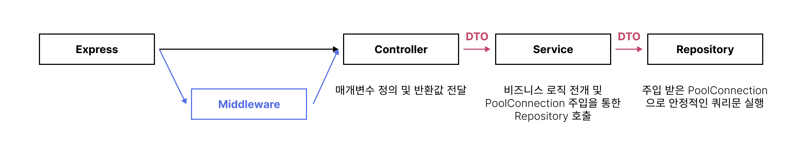

# 주특기 기본 주차 🎉 RESTful API 서버 (2)

- 서버 IPv4 : 15.164.229.98
- 해당 프로젝트는 [Boiler-Express](https://github.com/Boiler-Express/.github/blob/main/profile/BASIC-COURSE.md) 로 생성되었습니다.


<hr>

## 문서

- [문서 리스트](./docs/README.md)
  - [API 리스트](./docs/api/README.md)
    - [AUTH 리스트](./docs/api/AUTH.md)
    - [BOARD 리스트](./docs/api/BOARD.md)
    - [COMMENT 리스트](./docs/api/COMMENT.md)
  - [SQL 설명서](./docs/sql/README.md)
  - [트러블 슈팅](./docs/trouble_issue/README.md)

<hr>

## 작업 현황

| Milestone                                           | Tag    | Relaese |
| :-------------------------------------------------- | :----- | :------ |
| Prototype 기본 서버 구현 + Unit Test(all)            | @1.0.0 | - |

<hr>

## 모듈 리스트

```json
"dependencies": {
  "dotenv": "^16.0.1",
  "express": "^4.18.1"
},
"devDependencies": {
  "@babel/core": "^7.18.9",       // for testing, with es6.
  "@babel/preset-env": "^7.18.9",
  "@types/jest": "^28.1.6",       // for testing, with es6.
  "cross-env": "^7.0.3",
  "jest": "^28.1.3",              // for testing, with es6.
  "nodemon": "^2.0.19"
}
```
