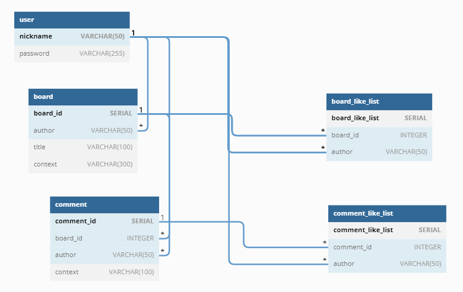
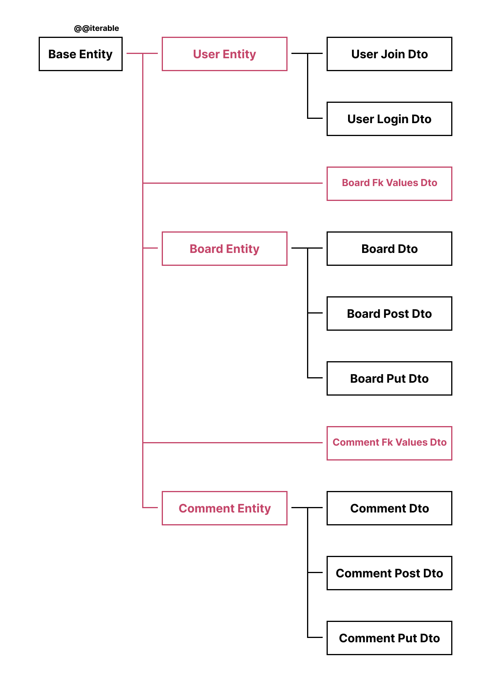

[< 뒤로 돌아가기](../README.md)

## SQL 설명서

### [쿼리문 보기](../../sql/default.sql)

총 `3 개`의 메인 테이블 (user, board, comment) 와 그 사이에 관계된 `2 개`의 테이블을 만들었습니다.

### ERD, _Entity Relationship Diagram_

### Entity-Dto

